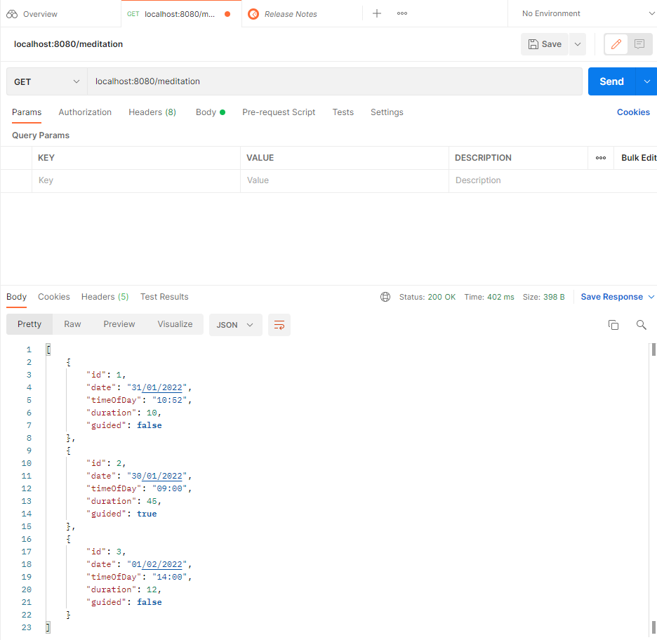
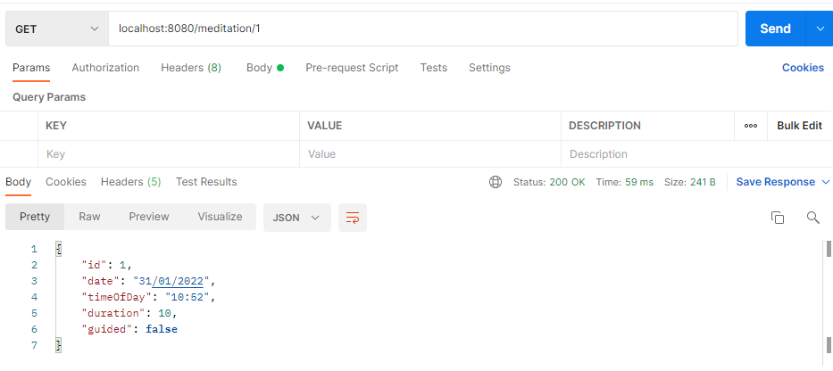
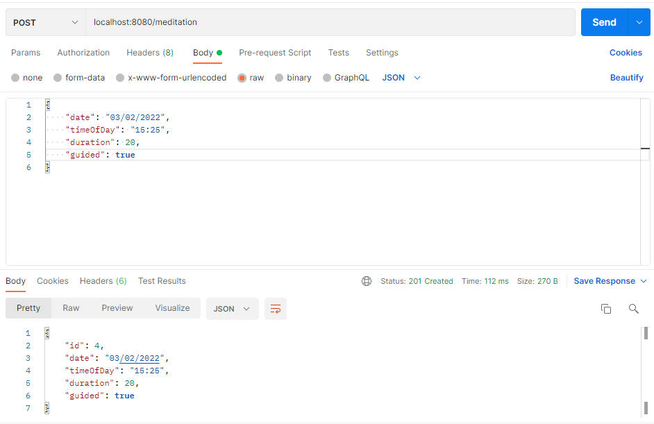
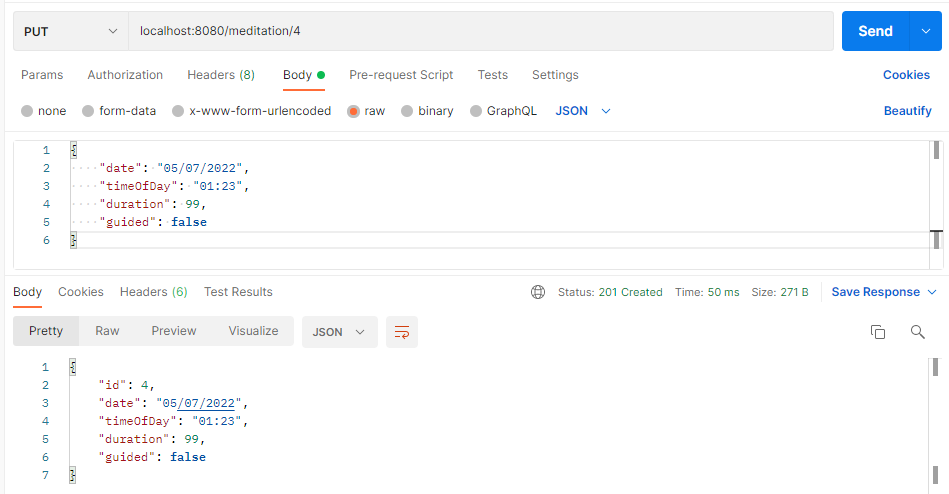
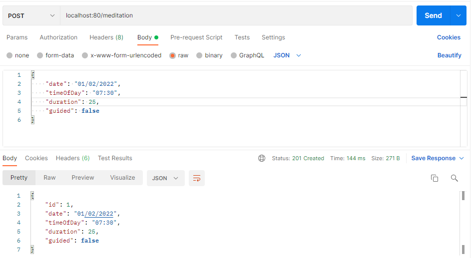
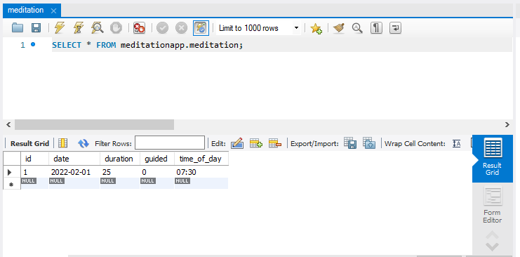
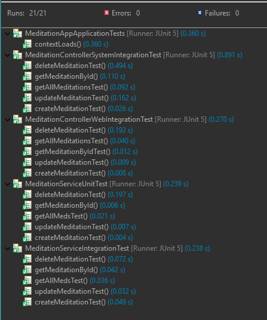
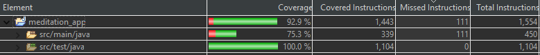

# Final Project for my QA Bootcamp

The objective of this project was to create a Spring Boot API using an application back-end developed using Java, 
a managed database hosted locally, and a means of making API calls and checking persistence.

I decided to create an app that tracks individual meditation sessions and information about them such as the date and time they took place, their duration and whether or not they were guided.
You can create, read, update and delete these meditations and have them persist on a local database.

## Why are we doing this?
The purpose of this project was to practice and put to use the skills
 I have developed and learnt over the nine week course. This included
  agile working, which is a common project management tool used by teams to
  make the process of software development more efficient by keeping everybody focused on one task at a time. I learnt how to use 
 source control management systems, more specifically Git, and I used GitHub as the web-based version control repository,
  implementing a feature-branch model. I then went through a few weeks of learning Java, including unit and integration testing, before moving onto Spring Boot
  which allows an app to run on it's own embedded web server, and was taught how to implement mockito in my tests.
  After all this I was given the project specification and it's minimum viable product and I was ready to go.
 
## How I expected this challenge to go

I initially felt quite well prepared for the project, as we had covered all the things we would need to know. However,
upon creating my GitHub repository and starting the initial commits and branches, I realised that I'd need go over some of
the previous concepts I had learnt as they weren't so fresh in my mind. At this point I knew the project would not
be easy, but I had all the resources I could ask for and knew I would be able to get it done.

## What went well and what didn't?

When I started with my Jira board, creating an Epic and User Stories for the CRUD functionality, it
 went quite well however I did initially forget to write the tasks that had to be done to complete these stories,
 but I later added these to the description of each story. I also didn't consider other epics that needed to be
 created in order to stasify the project specification, but I eventually realised and I created two more,
 one for documentation, and one for testing
with appropriate user stories and acceptance criteria for each.

My Spring Boot API went well, I had fun learning how to implement LocalDate
 for my entity and changing the JSON format. I completed the CRUD functionality and opened the Postman client to 
 make sure everything was working and was relieved when all went as expected.
 However when I got around to testing,
  things started to slow down.
 I found it quite challenging fully understanding the implementation of mockito, but as I went 
 along I picked it up and it was satisfying to pass each test.

## Possible improvements for future 

To improve on this project, I would like to add custom queries such as find by date, and find by duration etc. It would
also be helpful to implement some statistical analysis functions for the meditations and
also add a way to track mood and graphically display correlations between mood and 
meditation time.

Additionally 
I would like to create a front-end for this app, so it would be suitable for anyone to easily download and use as well as create
a mobile app version.

## Screenshots for postman requests

Get all meditations request being sent, and a response containing all three meditations and their data:

Get meditation by ID request being sent, and a response showing the data for that meditation:

Create meditation request being sent, and a response show that meditation with its id:

Updating the meditation with id of 4, and a response showing the updated object:

## Screenshots of database persistence

Put request:

MySQL Workbench after the app has stopped running:

## Screenshots of test coverage

All tests passed:

Test coverage:

## Link to Jira Board

https://bootcampnt.atlassian.net/jira/software/projects/BOOT/boards/2
